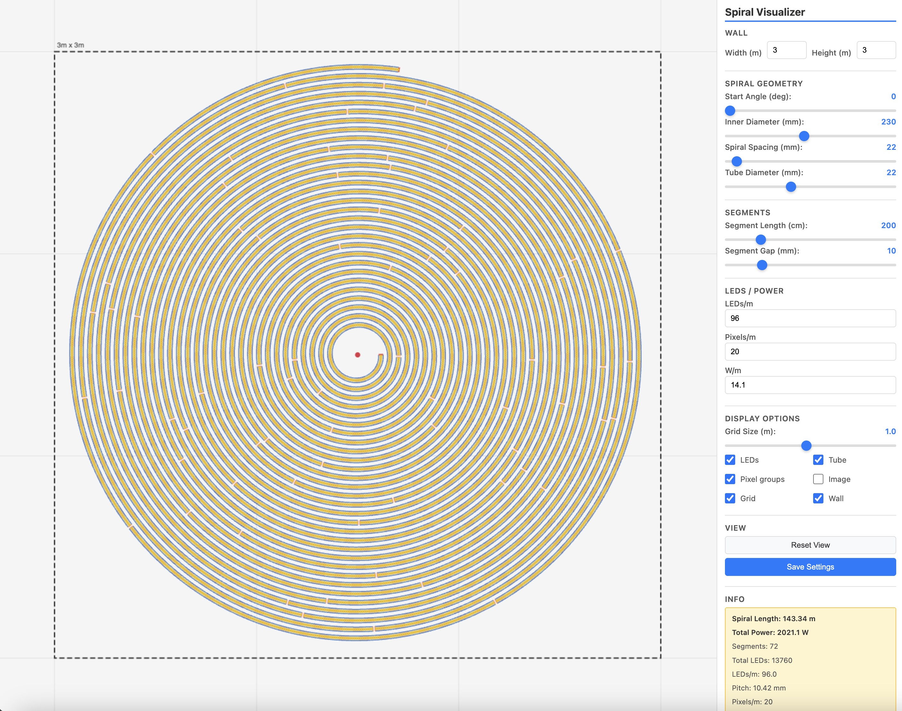
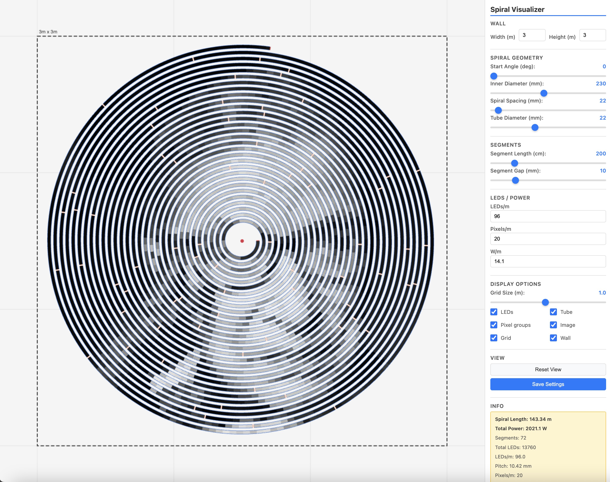

# Spiral Visualizer
Note: This project was developed with AI assistance.

Interactive web app for planning and visualizing a spiral LED tube layout on a wall. It lets you tune geometry, segmentation, LED density, pixel grouping, and power assumptions, then instantly see a scaled preview and key totals.

## Live Demo
[https://stephanschulz.ca/spiral-viz/](https://stephanschulz.ca/spiral-viz/)

## What This App Does
- Models an Archimedean spiral based on wall size and tube geometry
- Splits the spiral into physical segments with optional segment gaps
- Calculates practical output values like total length, LEDs, pixels, turns, and power
- Visualizes tube edges, LED positions, pixel groups, grid, and wall bounds
- Supports optional image sampling mode to preview pixel-group color mapping

## Screenshots

## Controls Overview
- **Wall**: set wall width and height in meters
- **Spiral Geometry**: adjust start angle, inner diameter, spacing, and tube diameter
- **Segments**: define segment length and inter-segment gap
- **LEDs / Power**: set LEDs/m, pixels/m, and watts/m
- **Display Options**: toggle LEDs, tube, pixel groups, image mode, grid, and wall
- **View**: reset camera and save settings locally in your browser

## Deploy
Every push to `main` triggers `.github/workflows/deploy-pages.yml` and publishes the static site.
